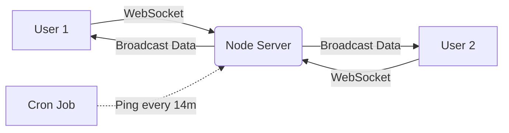

# 🎨 CO-DRAW v3.0 | Cyberpunk Collaboration Suite


> **A High-Performance Real-Time Collaborative Whiteboard engineered for low-latency communication.**
> *Secure Rooms. Instant Sync. Zero Clutter.*

---

## 🚀 **Live Demonstration**

### [🌐 Launch Co-Draw Terminal](https://co-draw-final.vercel.app)
*(Open this link in multiple tabs or devices to test real-time synchronization!)*

---

## 📸 **System Interface**

| **🔐 Secure Login Terminal** | **🎨 Tactical Drawing Board** |
|:---:|:---:|
|  |  |

---

## ⚡ **Key Features**

* **🟢 Real-Time Bi-Directional Sync:** Powered by **Socket.io**, delivering drawing coordinates in **<30ms**, ensuring a seamless multiplayer experience.
* **🛡️ Room-Based Isolation:** Dynamic UUID generation creates private, encrypted-like sessions where data is broadcasted only to specific room participants.
* **🖌️ High-Performance Rendering:** Custom **HTML5 Canvas** implementation with a proprietary `useDraw` hook to minimize re-renders and maintain **60 FPS**.
* **🤖 Server Keep-Alive System:** Integrated **Cron-Job** heartbeat mechanism to bypass Render's free-tier sleep mode, ensuring instant server response 24/7.
* **💎 Cyberpunk Aesthetic:** A fully responsive **Glassmorphism UI** with Neon accents, built using stabilized Inline Styles for layout integrity across all devices.

---

## 🛠️ **Tech Stack & Architecture**

### **Frontend (The Body)**
* **Next.js 14** (React Framework)
* **TypeScript** (Type Safety)
* **HTML5 Canvas API** (Graphics Engine)
* **Vercel** (Global CDN Hosting)

### **Backend (The Engine)**
* **Node.js & Express** (Runtime Environment)
* **Socket.io** (WebSocket Protocol)
* **CORS** (Security Policies)
* **Render** (Server Hosting)

### **System Architecture**


---

## 💻 **Installation & Local Setup**

Want to run this locally? Follow these tactical steps.

### **1. Clone the Repository**

```bash
git clone [https://github.com/your-username/co-draw-final.git](https://github.com/your-username/co-draw-final.git)
cd co-draw-final

```

### **2. Ignite the Backend (Server)**

```bash
cd server
npm install
node index.js

```

*Console Output:* `SERVER RUNNING on port 3001 🚀`

### **3. Launch the Frontend (Client)**

Open a new terminal:

```bash
cd client
npm install
npm run dev

```

*Access the terminal at:* `http://localhost:3000`

---

## ⚙️ **Configuration**

To switch between Local and Production environments, modify `client/app/[roomId]/page.tsx`:

```typescript
// For Local Development (Offline Mode)
// const socket = io("http://localhost:3001");

// For Production (Online Mode)
const socket = io("[https://co-draw-mr8e.onrender.com](https://co-draw-mr8e.onrender.com)");

```

---

## 🤝 **Contribution**

The connection is open. If you want to upgrade the system:

1. Fork the repository.
2. Create a feature branch (`git checkout -b feature/CyberUpgrade`).
3. Commit changes (`git commit -m 'Deployed new protocol'`).
4. Push to branch (`git push origin feature/CyberUpgrade`).
5. Open a Pull Request.


---

<p align="center">
<i>"Technology is best when it brings people together."</i> 


Built with ❤️ & ☕ code.
</p>

